# stochastic-dl-geospatial
# A Systematic Evaluation of Deep Learning Architectures for Geospatial Image Classification

This repository contains the code and analysis for a comprehensive study on classifying land-use from satellite imagery using a hierarchy of modern deep learning models. The project evaluates four distinct architectures on the EuroSAT dataset, focusing on performance, predictive uncertainty, computational efficiency, and the geometry of the optimization landscape.

This work serves as a practical guide for model selection in real-world applications and frames the classification task as a foundational step for generating **alternative data** for quantitative financial modeling.

---

## Table of Contents
1. [Project Overview](#project-overview)
2. [Methodology](#methodology)
3. [Performance Results](#performance-results)
    - [Summary Table](#summary-table)
    - [Comparative Learning Curves](#comparative-learning-curves)
    - [Confusion Matrix Analysis](#confusion-matrix-analysis)
    - [Per-Class F1-Score Comparison](#per-class-f1-score-comparison)
4. [Uncertainty Quantification](#uncertainty-quantification)
    - [MC Dropout & Deep Ensemble Uncertainty](#mc-dropout--deep-ensemble-uncertainty)
    - [Mean Uncertainty by Class](#mean-uncertainty-by-class)
5. [Advanced Analysis](#advanced-analysis)
    - [Loss Landscape Geometry](#loss-landscape-geometry)
6. [Proposed Financial Application](#proposed-financial-application)
7. [Setup and Usage](#setup-and-usage)

---

## Project Overview

The core objective of this research is to move beyond a simple classification task and conduct a rigorous, multi-faceted analysis of deep learning models for a practical application. We use the **EuroSAT dataset**, which contains 27,000 labeled satellite images across 10 distinct land-use classes, as a proxy for real-world economic and environmental activity.

Our analysis compares four models of increasing complexity:
- **LeNet-5:** A foundational CNN to establish a performance baseline.
- **ResNet-18:** A deep residual network representing modern CNN architectures.
- **Vision Transformer (ViT):** A state-of-the-art, attention-based architecture.
- **Deep Ensemble:** An ensemble of ResNet models to maximize robustness and accuracy.

## Methodology

The project was implemented in Python using TensorFlow 2.x on a Paperspace cloud instance equipped with an **NVIDIA RTX A6000 GPU**. The workflow included:
- An optimized `tf.data` input pipeline with asynchronous prefetching.
- On-the-fly data augmentation (random flips, rotations, zooms) to improve model generalization.
- Smart training callbacks (`EarlyStopping`, `ModelCheckpoint`) to prevent overfitting and save the best-performing models.

## Performance Results

### Summary Table

A systematic evaluation demonstrates a clear performance hierarchy, validating the effectiveness of advanced architectures and ensembling techniques. The Deep Ensemble model achieved a state-of-the-art accuracy of **95.39%**.

| Model                   | Test Accuracy | Best Val Accuracy | Approx. Train Time (min) |
|-------------------------|:-------------:|:-----------------:|:------------------------:|
| LeNet-5 (Baseline)      |    72.75%     |      74.29%       |           3.0            |
| ResNet-18               |    92.26%     |      92.89%       |           3.2            |
| Vision Transformer (ViT)|    91.48%     |      92.11%       |           9.7            |
| ResNet-18 Ensemble (x5) |  **95.39%**   | N/A (Aggregate)   |          ~94.9           |

### Comparative Learning Curves

The validation accuracy curves illustrate the different learning dynamics. The ViT shows the most stable convergence, while the ResNet learns aggressively but with higher variance. LeNet-5 plateaus early, indicative of its limited learning capacity.

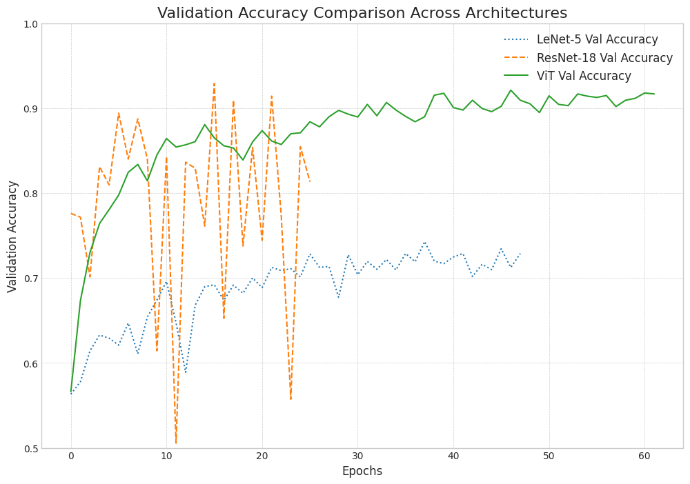

### Confusion Matrix Analysis

The raw-count confusion matrices show the specific number of misclassifications for each model. Note the dramatic reduction in errors, especially for `Highway` and `PermanentCrop`, as the models become more sophisticated.

| LeNet-5 (Baseline) | ResNet-18 |
| :---: | :---: |
| 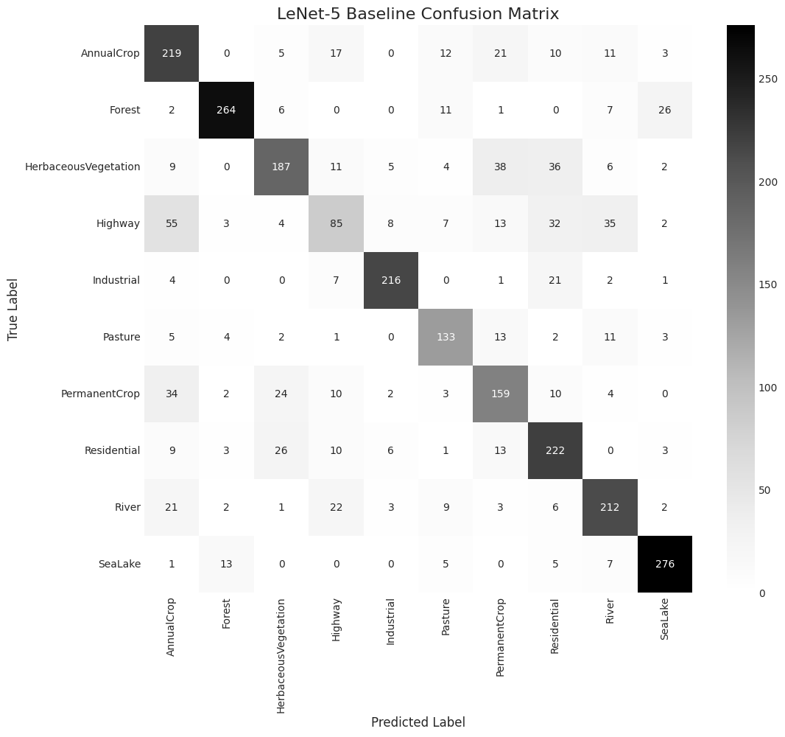 | 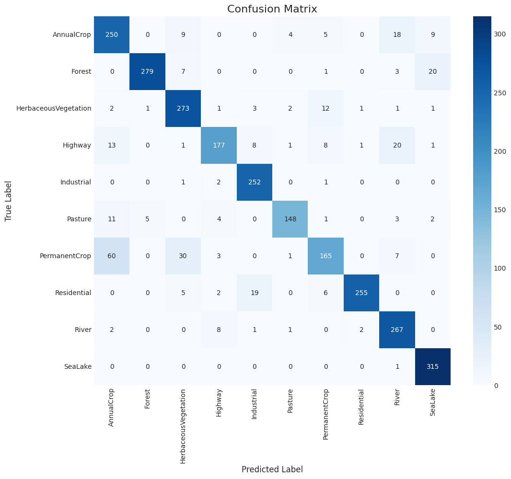 |
| **Vision Transformer** | **ResNet-18 Ensemble** |
| 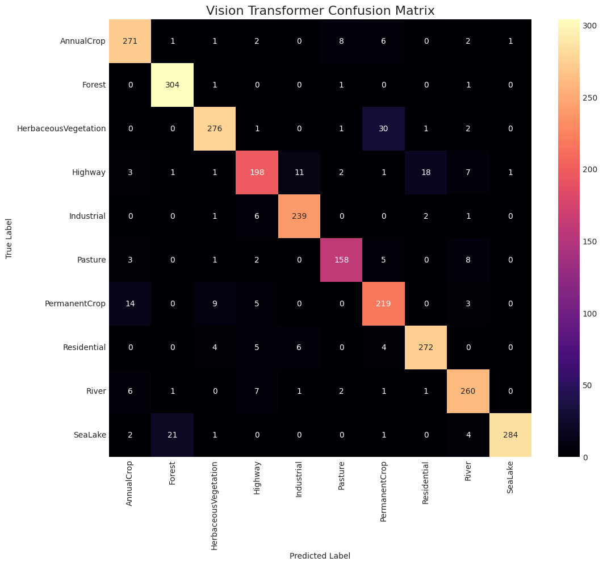 | 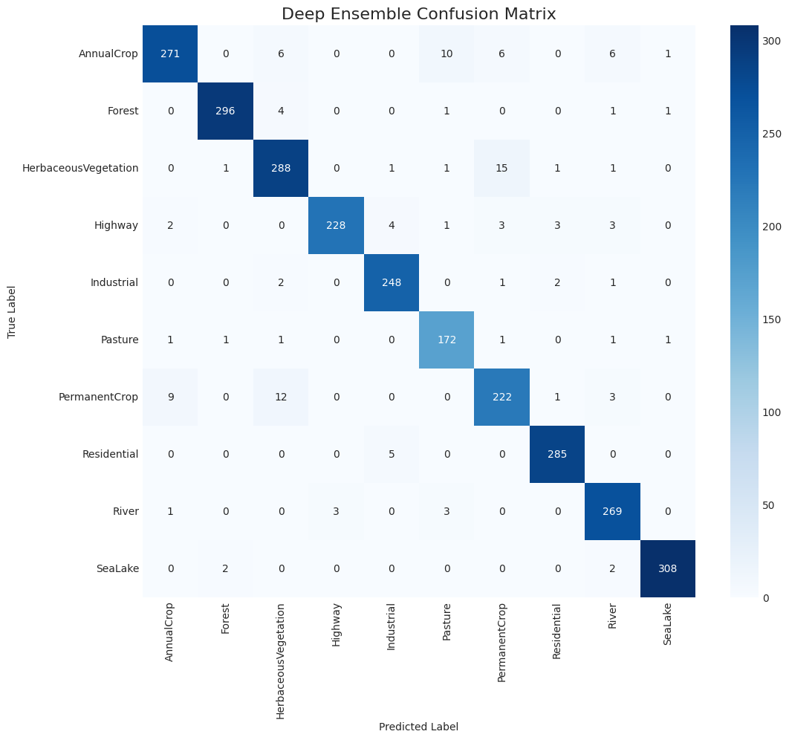 |

The normalized confusion matrices below make it easier to compare the per-class recall rates (the diagonal) directly. The diagonal becomes progressively brighter and more solid, indicating higher recall and a more confident model.

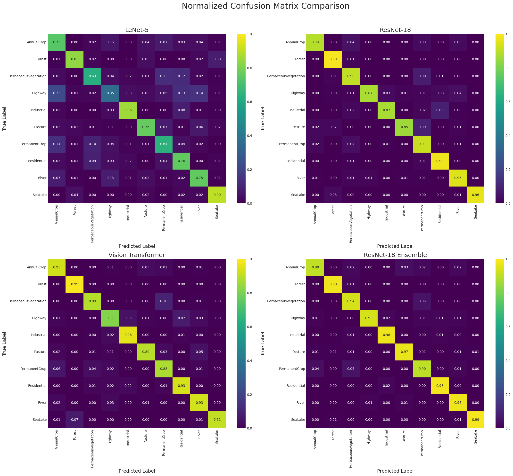

### Per-Class F1-Score Comparison

This plot highlights where the improvements were most significant. The ensemble model dramatically boosts the F1-score for challenging classes like `Highway` and `PermanentCrop`, effectively solving the baseline model's primary weaknesses.

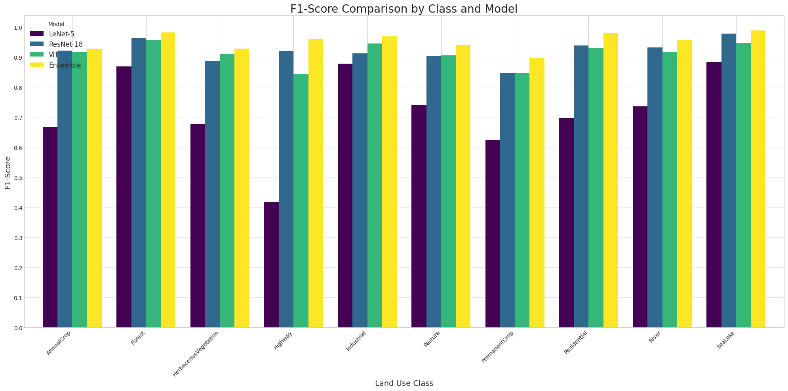

## Uncertainty Quantification

A key contribution of this work is the analysis of model uncertainty, a critical factor for risk-sensitive applications.

### MC Dropout & Deep Ensemble Uncertainty

We implemented Bayesian approximation techniques to quantify model confidence. The visualizations below show sample predictions from the single ResNet (using MC Dropout) and the Deep Ensemble. Each title includes the true label, the model's prediction and confidence, and the calculated uncertainty score (higher means more uncertain).

| MC Dropout (Single ResNet) | Deep Ensemble |
| :---: | :---: |
| 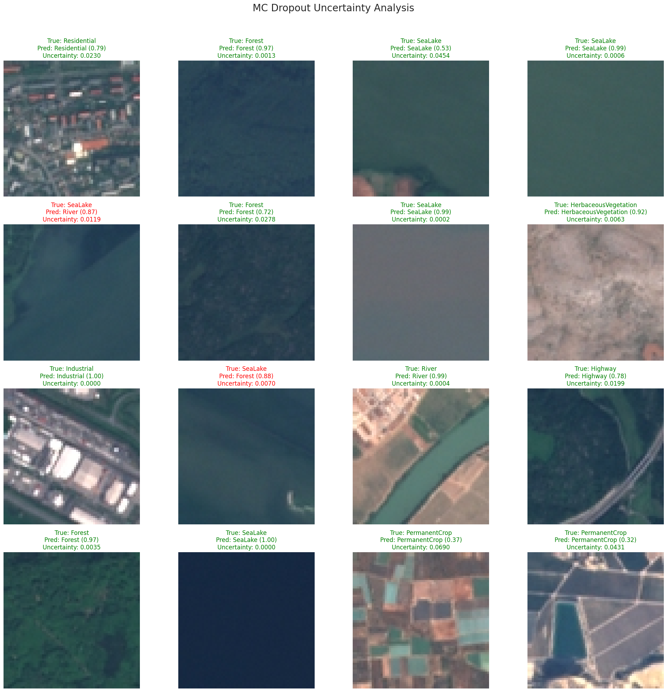 | 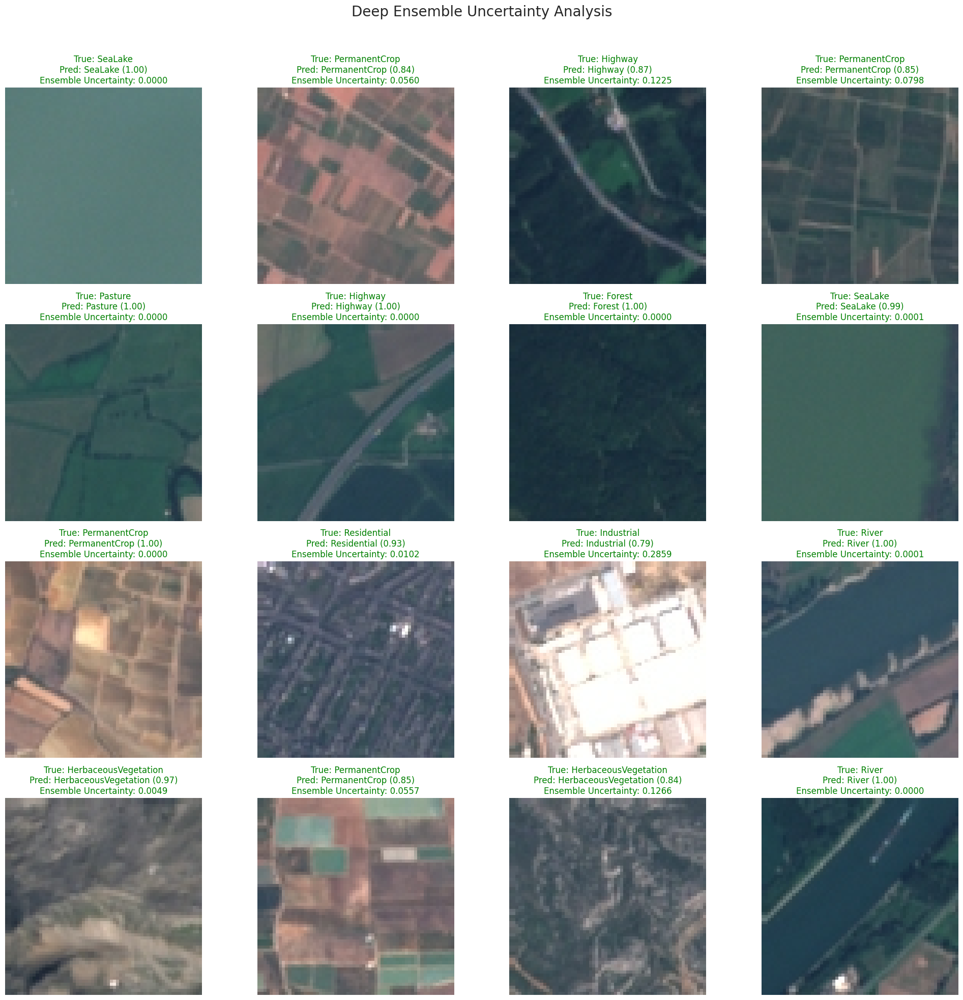 |

### Mean Uncertainty by Class

Analysis revealed a strong correlation between high uncertainty and high misclassification rates. The classes the models found most difficult, such as `PermanentCrop` and `Highway`, consistently exhibited the highest predictive variance.

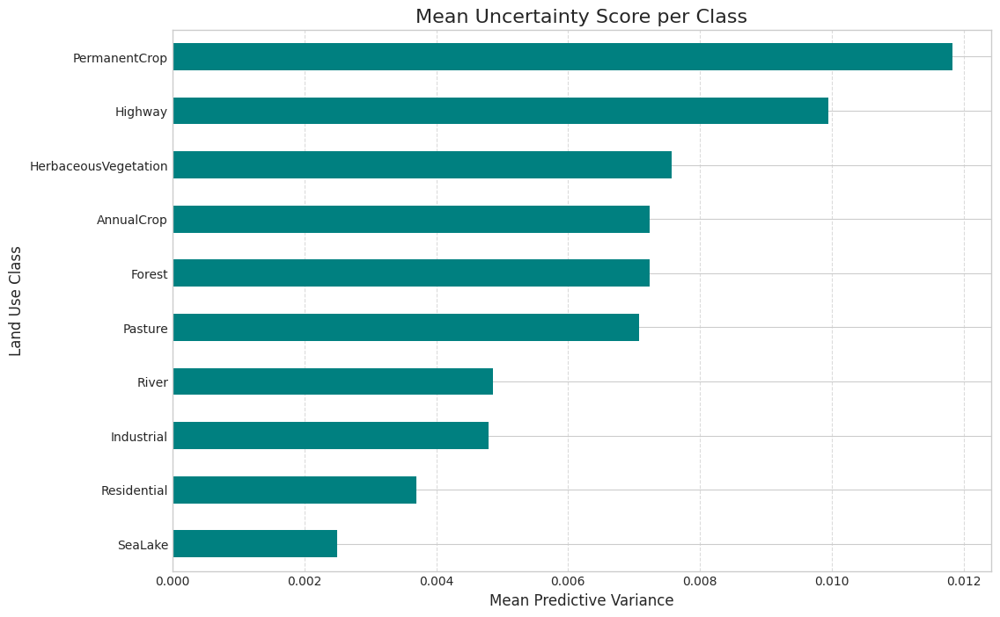

## Advanced Analysis

### Loss Landscape Geometry

To understand *why* the ensemble generalizes better, we analyzed the geometry of the optimization landscape by approximating the **trace of the Hessian matrix**. The results provide quantitative evidence for the "flat minima" hypothesis: the ensemble member converged to a significantly flatter (lower sharpness score) minimum than the singularly trained ResNet, indicating a more robust solution.

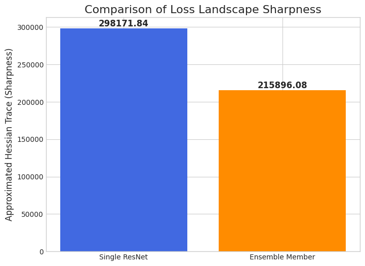

## Proposed Financial Application

The features and uncertainty metrics from our final ensemble model are production-ready inputs for quantitative financial models. We propose extending this work by:
1.  Creating a time-series of land-use features ($X_t$) from historical satellite data.
2.  Integrating this feature set into a **stochastic volatility model** (e.g., Heston-like) to forecast commodity options prices, where the long-term mean volatility $\theta$ becomes a function of our satellite data, $\theta(X_t)$.
3.  Using the model's uncertainty output to inform the risk parameters of the financial model.
4.  Implementing the final Monte Carlo pricing simulation using custom **CUDA** kernels for maximum performance.

## Setup and Usage

This project is structured as a series of Jupyter/Paperspace notebook cells.

**Dependencies:**
- Python 3.9+
- TensorFlow 2.10+
- NumPy, Pandas, Scikit-learn, Seaborn, Matplotlib
- Kaggle API, Numba

**Running the Project:**
1.  Clone the repository.
2.  Install the required dependencies: `pip install -r requirements.txt`
3.  Obtain a `kaggle.json` API token from your Kaggle account and place it in the root directory.
4.  Run the cells in the main notebook (`Eurosat_Classification.ipynb`) sequentially. The notebook is designed to handle data download, setup, training, and analysis in a self-contained manner.
